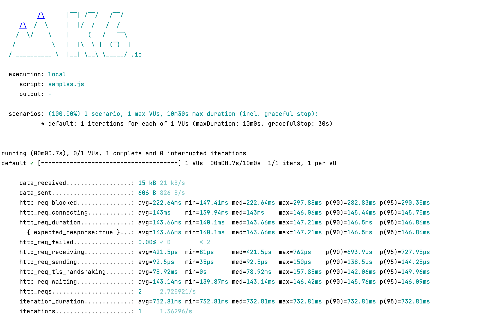

# Демо проект workshop по k6 Tinkoff
В рамках workshop вы узнаете, как писать тесты производительности на k6 и как применять фичи этого инструмента, которые помогут в тестировании производительности.

## Подготовка к workshop

- Вам необходимо заранее установить на свой компьютер [k6](https://k6.io/docs/getting-started/installation/)
- Для удобства можно дополнительно установить любую IDEA + плагин k6:
  - https://www.jetbrains.com/idea/ - IDEA JetBrains
  - https://plugins.jetbrains.com/plugin/16141-k6 - plugin for IDEA JetBrains
  - https://code.visualstudio.com/download - Visual Studio Code
  - https://marketplace.visualstudio.com/items?itemName=k6.k6 – plugin for VS Code
- Запустить скрипт [samples.js](./samples.js) из репозитория командой: `k6 run samples.js`
- Получить следующий вывод на экран показывающий успешное выполнение скрипта:

- Установить [Docker](https://docs.docker.com/get-docker/) и [Docker Compose](https://docs.docker.com/compose/install/) на свой компьютер.

## Дополнительная информация

Готовый проект, который у вас получится во время workshop уже залит в данные репозиторий в файл [example.js](./example.js). 

Файл конфигурации Docker [docker-compose.yml](./docker-compose.yml) и папка с конфигурацией дашбордов [/grafana](/grafana).
